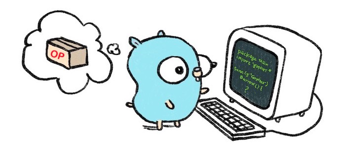

# `op-challenger` • [](https://github.com/refcell/op-challenger/actions/workflows/ci.yml) 

A multi-mode op-stack challenge agent for output dispute games written in golang.

> **Warning**
>
> This is a WIP Proof of Concept and is not ready, nor intended, for production use.
> Please visit the [Optimism Monorepo](https://github.com/ethereum-optimism/optimism) repository so you don't footgun yourself.


## Usage

The easiest way to install `op-challenger` is to download the latest binary from [challenger.refcell.org](https://challenger.refcell.org). To do this, just run:

```bash
curl -s https://challenger.refcell.org | sh
```

<p align="center">
  
</p>

Alternatively, you can build the `op-challenger` binary locally using the pre-configured makefile target by running `make build`, and then running `./op-challenger --help` to see the available options.

`op-challenger` is configurable via command line flags and environment variables. The help menu shows the available config options and can be accessed by running `./op-challenger --help`.

Note that there are many global options, but the most important ones are:

```md
`OP_CHALLENGER_L1_ETH_RPC`: An L1 Ethereum RPC URL
`OP_CHALLENGER_ROLLUP_RPC`: A Rollup Node RPC URL
`OP_CHALLENGER_L2OO_ADDRESS`: The L2OutputOracle Contract Address
`OP_CHALLENGER_DGF_ADDRESS`: Dispute Game Factory Contract Address
`OP_CHALLENGER_PRIVATE_KEY`: The Private Key of the account that will be used to send challenge transactions
`OP_CHALLENGER_L2_CHAIN_ID`: The chain id of the L2 network
```

Here is the full output of `./op-challenger --help`:

```bash
NAME:
   op-challenger - Multi-mode Challenger Agent

USAGE:
   main [global options] command [command options] [arguments...]

VERSION:
   1.0.0

DESCRIPTION:
   A multi-mode op-stack challenge agent for output dispute games written in golang.

COMMANDS:
   help, h  Shows a list of commands or help for one command

GLOBAL OPTIONS:
   --l1-eth-rpc value                      HTTP provider URL for L1. [$OP_CHALLENGER_L1_ETH_RPC]
   --rollup-rpc value                      HTTP provider URL for the rollup node. [$OP_CHALLENGER_ROLLUP_RPC]
   --l2oo-address value                    Address of the L2OutputOracle contract. [$OP_CHALLENGER_L2OO_ADDRESS]
   --dgf-address value                     Address of the DisputeGameFactory contract. [$OP_CHALLENGER_DGF_ADDRESS]
   --private-key value                     The private key to use with the service. Must not be used with mnemonic. [$OP_CHALLENGER_PRIVATE_KEY]
   --rpc.addr value                        rpc listening address (default: "0.0.0.0") [$OP_CHALLENGER_RPC_ADDR]
   --rpc.port value                        rpc listening port (default: 8545) [$OP_CHALLENGER_RPC_PORT]
   --log.level value                       The lowest log level that will be output (default: "info") [$OP_CHALLENGER_LOG_LEVEL]
   --log.format value                      Format the log output. Supported formats: 'text', 'terminal', 'logfmt', 'json', 'json-pretty', (default: "text") [$OP_CHALLENGER_LOG_FORMAT]
   --log.color                             Color the log output if in terminal mode [$OP_CHALLENGER_LOG_COLOR]
   --metrics.enabled                       Enable the metrics server [$OP_CHALLENGER_METRICS_ENABLED]
   --metrics.addr value                    Metrics listening address (default: "0.0.0.0") [$OP_CHALLENGER_METRICS_ADDR]
   --metrics.port value                    Metrics listening port (default: 7300) [$OP_CHALLENGER_METRICS_PORT]
   --pprof.enabled                         Enable the pprof server [$OP_CHALLENGER_PPROF_ENABLED]
   --pprof.addr value                      pprof listening address (default: "0.0.0.0") [$OP_CHALLENGER_PPROF_ADDR]
   --pprof.port value                      pprof listening port (default: 6060) [$OP_CHALLENGER_PPROF_PORT]
   --mnemonic value                        The mnemonic used to derive the wallets for either the service [$OP_CHALLENGER_MNEMONIC]
   --hd-path value                         The HD path used to derive the sequencer wallet from the mnemonic. The mnemonic flag must also be set. [$OP_CHALLENGER_HD_PATH]
   --sequencer-hd-path value               DEPRECATED: The HD path used to derive the sequencer wallet from the mnemonic. The mnemonic flag must also be set. [$OP_BATCHER_SEQUENCER_HD_PATH]
   --l2-output-hd-path value               DEPRECATED:The HD path used to derive the l2output wallet from the mnemonic. The mnemonic flag must also be set. [$OP_PROPOSER_L2_OUTPUT_HD_PATH]
   --num-confirmations value               Number of confirmations which we will wait after sending a transaction (default: 10) [$OP_CHALLENGER_NUM_CONFIRMATIONS]
   --safe-abort-nonce-too-low-count value  Number of ErrNonceTooLow observations required to give up on a tx at a particular nonce without receiving confirmation (default: 3) [$OP_CHALLENGER_SAFE_ABORT_NONCE_TOO_LOW_COUNT]
   --resubmission-timeout value            Duration we will wait before resubmitting a transaction to L1 (default: 48s) [$OP_CHALLENGER_RESUBMISSION_TIMEOUT]
   --network-timeout value                 Timeout for all network operations (default: 2s) [$OP_CHALLENGER_NETWORK_TIMEOUT]
   --txmgr.send-timeout value              Timeout for sending transactions. If 0 it is disabled. (default: 0s) [$OP_CHALLENGER_TXMGR_TX_SEND_TIMEOUT]
   --txmgr.not-in-mempool-timeout value    Timeout for aborting a tx send if the tx does not make it to the mempool. (default: 2m0s) [$OP_CHALLENGER_TXMGR_TX_NOT_IN_MEMPOOL_TIMEOUT]
   --txmgr.receipt-query-interval value    Frequency to poll for receipts (default: 12s) [$OP_CHALLENGER_TXMGR_RECEIPT_QUERY_INTERVAL]
   --signer.endpoint value                 Signer endpoint the client will connect to [$OP_CHALLENGER_SIGNER_ENDPOINT]
   --signer.address value                  Address the signer is signing transactions for [$OP_CHALLENGER_SIGNER_ADDRESS]
   --signer.tls.ca value                   tls ca cert path (default: "tls/ca.crt") [$OP_CHALLENGER_SIGNER_TLS_CA]
   --signer.tls.cert value                 tls cert path (default: "tls/tls.crt") [$OP_CHALLENGER_SIGNER_TLS_CERT]
   --signer.tls.key value                  tls key (default: "tls/tls.key") [$OP_CHALLENGER_SIGNER_TLS_KEY]
   --help, -h                              show help
   --version, -v                           print the version
```


## Specifications

The op-challenger is a challenge agent for the output dispute game. It is responsible for challenging invalid state roots and invalid transactions. It is also responsible for challenging invalid fraud proofs.

This implementation is loosely based off the `op-proposer`, a proposer agent that is responsible for proposing new outputs to the `L2OutputOracle`. And this should make sense. Where the `op-proposer` _posts_ `output`s to the `L2OutputOracle`, the `op-challenger` validates these outputs and disputes them if invalid. Thus, the only additional functionality the `op-challenger` needs to implement is the ability to challenge invalid fraud proofs.

The naive challenge agent will be an attestation challenger which is a permissioned set of actors running the `op-challenger` attest.

The next iteration of the challenge agent will use fault proofs to challenge invalid outputs. This will involve a more complex dispute game which will allow for permissionless challengers by attaching bonds to each level of the dispute game.

A future iteration of permissionless outputs will allow for validity (zero-knowledge) proofs.


## Contributing

See [CONTRIBUTING.md](./CONTRIBUTING.md)


## License

[MIT](./LICENSE.md), forever and always.


## Acknowledgements

- [op-challenger](https://github.com/clabby/op-challenger): a challenge agent built in pure rust 🦀 by [clabby](https://github.com/clabby).
- [optimism](https://github.com/ethereum-optimism/optimism)
- [op-stack](https://stack.optimism.io/)
