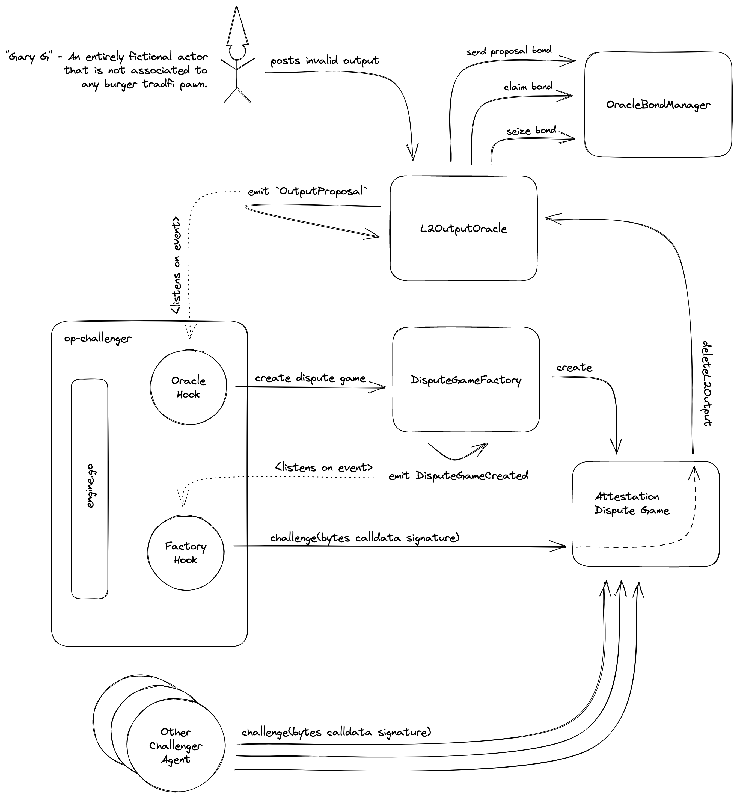

# op-challenger • [](https://github.com/refcell/op-challenger/actions/workflows/ci.yml)  

A modular [op-stack](https://stack.optimism.io/) challenge agent for attestation (fault and validity soon™) dispute games written in golang. Please note this is a proof of concept not intended for production use. The authors of this repository expressely recommond following the [rust-based op-challenger](https://github.com/clabby/op-challenger) for performance.

## Quickstart

First, clone the [Optimism Monorepo](https://github.com/ethereum-optimism/optimism) and set the `MONOREPO_DIR` environment variable to the path of that directory in a `.env` file as shown in `.env.example`.

Then, you can simply run `make`, which will compile all solidity + golang sources, bring up the Optimism [devnet](https://github.com/ethereum-optimism/optimism/blob/develop/ops-bedrock/devnet-up.sh) while also deploying the [mock dispute game contracts](./contracts), and then run the `op-challenger`.

Alternatively, you can build the `op-challenger` binary locally using the pre-configured makefile target by running `make build`, and then running `./op-challenger --help` to see the available options.

In the future, we intend to support downloading the `op-challenger` binary from [challenger.refcell.org](https://challenger.refcell.org) using `curl -s https://challenger.refcell.org | sh`

## Usage

`op-challenger` is configurable via command line flags and environment variables. The help menu shows the available config options and can be accessed by running `./op-challenger --help`.

Note that there are many global options, but the most important ones are:

- `OP_CHALLENGER_L1_ETH_RPC`: An L1 Ethereum RPC URL
- `OP_CHALLENGER_ROLLUP_RPC`: A Rollup Node RPC URL
- `OP_CHALLENGER_L2OO_ADDRESS`: The L2OutputOracle Contract Address
- `OP_CHALLENGER_DGF_ADDRESS`: Dispute Game Factory Contract Address
- `OP_CHALLENGER_PRIVATE_KEY`: The Private Key of the account that will be used to send challenge transactions
- `OP_CHALLENGER_L2_CHAIN_ID`: The chain id of the L2 network

Here is a reduced output from running `./op-challenger --help`:

```bash
NAME:
   op-challenger - Modular Challenger Agent

USAGE:
   main [global options] command [command options] [arguments...]

VERSION:
   1.0.0

DESCRIPTION:
   A modular op-stack challenge agent for output dispute games written in golang.

COMMANDS:
   help, h  Shows a list of commands or help for one command

GLOBAL OPTIONS:
   --l1-eth-rpc value                      HTTP provider URL for L1. [$OP_CHALLENGER_L1_ETH_RPC]
   --rollup-rpc value                      HTTP provider URL for the rollup node. [$OP_CHALLENGER_ROLLUP_RPC]
   --l2oo-address value                    Address of the L2OutputOracle contract. [$OP_CHALLENGER_L2OO_ADDRESS]
   --dgf-address value                     Address of the DisputeGameFactory contract. [$OP_CHALLENGER_DGF_ADDRESS]
   --private-key value                     The private key to use with the service. Must not be used with mnemonic. [$OP_CHALLENGER_PRIVATE_KEY]
   ...
   --help, -h                              show help
   --version, -v                           print the version
```


## Inner Workings

The op-challenger is a challenge agent for the output dispute game. It is responsible for challenging output roots.

This implementation is loosely based off the `op-proposer`, a proposer agent that is responsible for proposing new outputs to the `L2OutputOracle`. And this should make sense; where the `op-proposer` _posts_ `output`s to the `L2OutputOracle`, the `op-challenger` validates these outputs and disputes them if invalid. The primary functional difference the `op-challenger` must implement is the ability to challenge invalid outputs.

The naive challenge agent will be an attestation challenger which is a permissioned set of actors running the `op-challenger`. Below we illustrate how the challenger agent interacts with the [op-stack](https://stack.optimism.io/)'s permissionless output proposal system.



The next iteration of the challenge agent will use fault proofs to challenge invalid outputs. This will involve a more complex dispute game which will allow for permissionless challengers by attaching bonds to each level of the dispute game. A future iteration could allow for validity (zero-knowledge) proofs.


## Contributing

See [CONTRIBUTING.md](./CONTRIBUTING.md)


## License

[MIT](./LICENSE.md), forever and always.


## Acknowledgements

- [op-challenger](https://github.com/clabby/op-challenger): a rust challenge agent 🦀
- [optimism](https://github.com/ethereum-optimism/optimism): the optimism monorepo 🚀
- [op-stack](https://stack.optimism.io/): the op-stack 🥳
